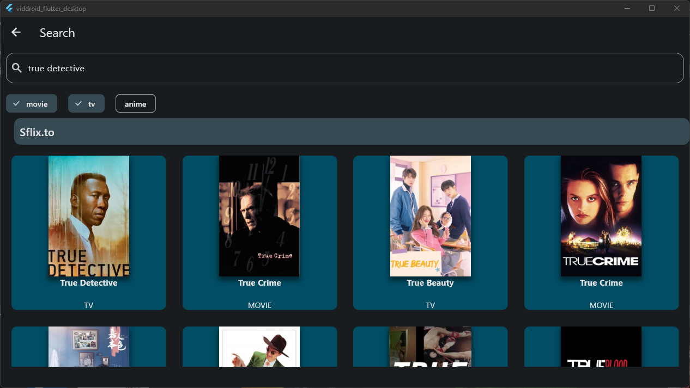
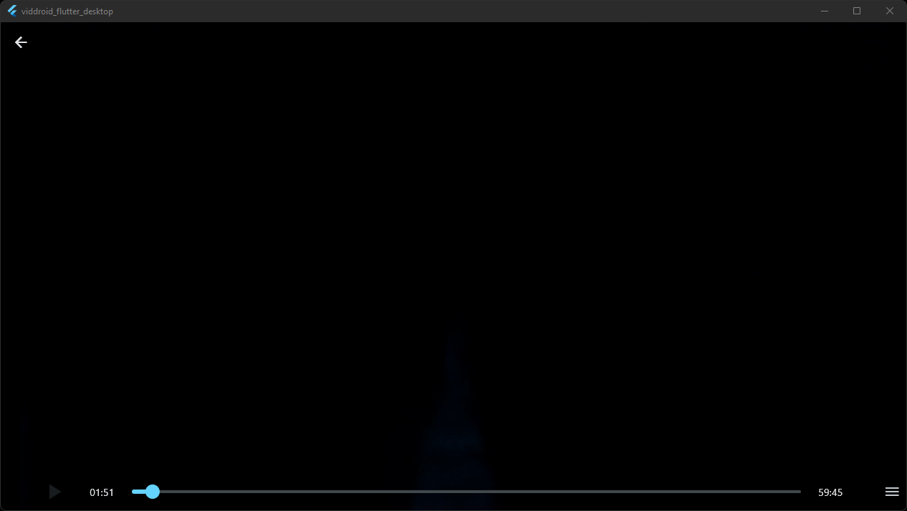

# Viddroid

Viddroid is a desktop application, which allows to stream, download and bookmark tv-shows, movies, and anime.

By itself, Viddroid includes some streaming providers. However, it is planned to construct a custom scripting-language,
which would enable users to include custom providers. But, before this enhancement, the app has to be in a stable and
semi-finished state.

As this project could get pretty big, help is always appreciated.

## Platforms

Viddroid supports all major desktop operating systems, with hardware accelerated video playback, thanks
to [media_kit](https://github.com/alexmercerind/media_kit)! Further, Viddroid supports AndroidTV and thereby Chromecast.

| **Platform** | **Support** |
|--------------|-------------|
| Windows      | Ready       | 
| Linux        | Ready       | 
| macOS        | Ready       |
| AndroidTV    | Ready       |

## Features
- No advertisements, whatsoever.
- Bookmark your favorite movies / shows.
- Download and stream your favorite movies and shows.
- Desktop support for all major operating systems (Windows, MacOS, Linux).
- No tracking, no analytics.
- Android TV support.

## Overview

## Roadmap

- [x] Basic structure
- [x] Providers and extractors
- [x] Functional and beautiful enough UI
- [x] Downloading media
- [x] Setting's structure
- [x] Custom proxies
- [ ] Download progress indicators
- [x] Subtitles
- [ ] Interactive UI
- [ ] Media bookmarking
- [ ] Custom Providers (implemented through a custom scripting-language) / Detach the providers from the codebase
  and turn them into extensions (e.g. [Cloudstream](https://github.com/recloudstream/cloudstream))
- [ ] Translations
