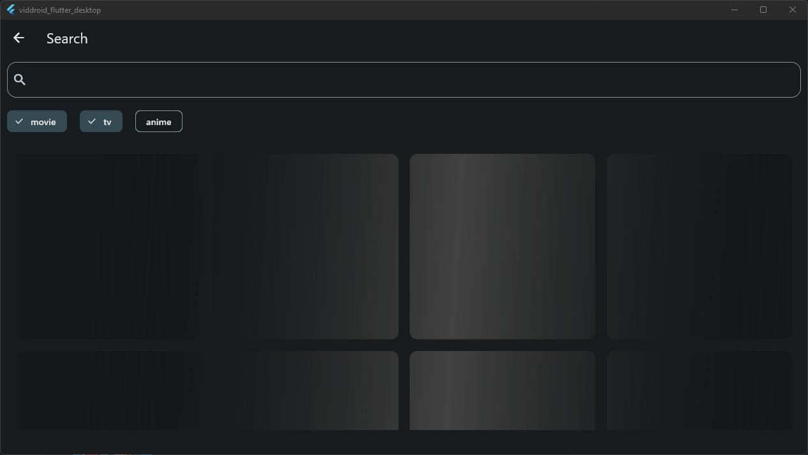
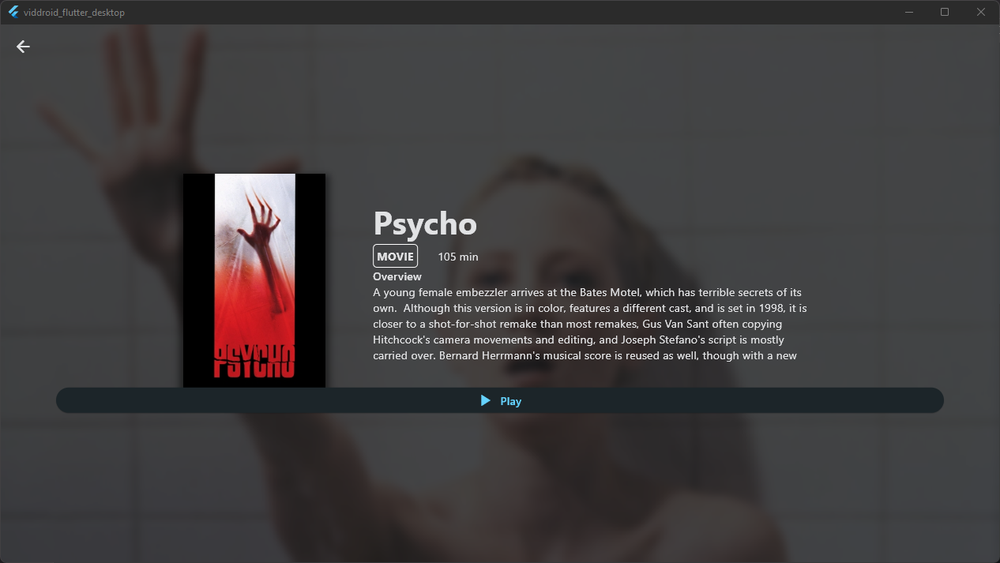

# Viddroid

Viddroid is a desktop application, which allows to stream, download and bookmark tv-shows, movies, and anime.

By itself, Viddroid includes some streaming providers. However, it is planned to construct a custom scripting-language,
which would enable users to include custom providers. But, before this enhancement, the app has to be in a stable and
semi-finished state.

If you are searching for an extensive Android application which accomplishes the same feat, have a look
at [Cloudstream](https://github.com/recloudstream/cloudstream).

As this project could get pretty big, help is always appreciated. 

## Support

Currently, Windows and Linux are the primary supported operating systems. This is due to a limitation with Flutter.
While Flutter is able to handle video streams on mobile perfectly, there is [no official support](https://github.com/flutter/flutter/issues/37673) for the desktop platform yet. 
As a result, I use the library [media_kit](https://github.com/alexmercerind/media_kit), which has been created by great individuals to accomplish the feat of video playback and uses
native bindings to [libmpv](https://github.com/mpv-player/mpv/tree/master/libmpv).
This library, however, is work-in-progress and MacOS support is in reach. Once the MacOS support has been announced, I will update the project accordingly. 

## Features
- Ad free
- Bookmark your favorite media items
- Download and stream your favorite media
- Desktop support, standalone website coming
- No tracking, no analytics

## Overview

## Roadmap

- [x] Basic structure
- [x] Providers and extractors
- [x] Functional and beautiful enough UI
- [x] Downloading media
- [ ] Settings
- [ ] Custom proxies
- [ ] Download progress indicators
- [ ] Subtitles
- [ ] Interactive UI
- [ ] Media bookmarking
- [ ] Custom Providers (implemented through a custom scripting-language) / Detach the providers from the codebase
  and turn them into extensions (e.g. [Cloudstream](https://github.com/recloudstream/cloudstream))
- [ ] Translations

